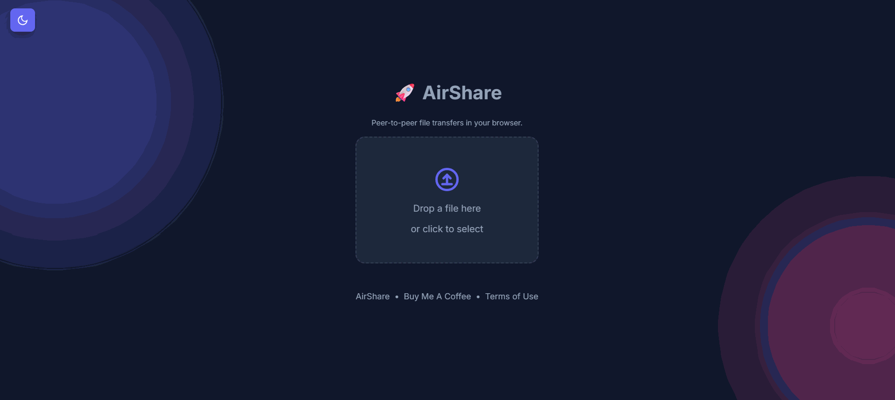

# 🚀 AirShare
  
  ### Peer-to-peer file transfers in your browser.
  *A modern, clean, and secure implementation inspired by FilePizza.*

  [](https://github.com/jaberio/airshare/actions/workflows/docker-publish.yml)
  [](https://opensource.org/licenses/MIT)
  [](https://buymeacoffee.com/Jay_me)

---

## 🎬 Demo

<div align="center">
  
</div>

---

## ✨ Features

- **🛡️ Peer-to-Peer**: Files are transferred directly between devices using WebRTC. We never store your files.
- **♾️ No Size Limits**: Transfer files of any size (limited only by your browser).
- **🔒 Secure**: End-to-end encryption in transit.
- **⚡ Fast & Simple**: Drag and drop, share the link, and you're done.
- **🌙 Dark Mode**: Premium UI with native dark mode support.
- **🐳 Docker Ready**: Optimized for containerized deployments.

---

## 🚀 Quick Start with Docker (Recommended)

Run the application instantly using GitHub Container Registry:

```bash
docker run -d \
  -p 4111:3000 \
  --name airshare \
  --restart unless-stopped \
  ghcr.io/jaberio/airshare:v1.0.0
```

Open your browser and visit: `http://localhost:4111`

---

## � Documentation

Full documentation is available at: **[https://jaberio.github.io/airshare/](https://jaberio.github.io/airshare/)**

- [Getting Started](https://jaberio.github.io/airshare/docs/intro)
- [Installation Guide](https://jaberio.github.io/airshare/docs/installation)
- [Configuration Options](https://jaberio.github.io/airshare/docs/configuration)
- [Development Guide](https://jaberio.github.io/airshare/docs/development)

---

## �💻 Local Development

### 1. Clone & Install
```bash
git clone https://github.com/jaberio/airshare.git
cd airshare
npm install
```

### 2. Configure
Copy the example environment file and adjust as needed:
```bash
cp .env.example .env
```

### 3. Run
```bash
# Recommended: dev server + client bundler (watch)
npm run dev

# Or: one-time client build then run server
# npm run build:client
# npm start
```
Visit: `http://localhost:3000`

---

## 🐳 Docker Compose

For more complex setups, use the included `docker-compose.yml`. This configuration includes production-ready defaults like restart policies, health checks, and isolated networks.

```bash
docker-compose up -d
```

---

## 🔧 Environment Variables

### Server Configuration
- `PORT` - Server port (default: `3000`)
- `NODE_ENV` - Node environment (default: `development`)
- `MAX_FILE_SIZE` - Maximum file size allowed in bytes (default: `107374182400` = 100GB)
- `APP_TITLE` - Application title (default: `AirShare`)
- `THEME_COLOR` - Primary theme color hex code (default: `#6366f1`)

### WebRTC Streaming & Backpressure (Enterprise)
- `MAX_IN_MEMORY_SIZE` - Files larger than this use streaming to disk (default: `209715200` = 200MB)
  - Uses File System Access API on Chrome/Edge 86+
  - Fallback to in-memory with warning on unsupported browsers (Safari, Firefox)
- `DEFAULT_CHUNK_SIZE` - Initial chunk size for transfers (default: `131072` = 128KB)
- `MIN_CHUNK_SIZE` - Minimum chunk size under backpressure (default: `32768` = 32KB)
- `MAX_CHUNK_SIZE` - Maximum chunk size when stable (default: `262144` = 256KB)
- `BUFFER_HIGH_WATER` - Pause sender when buffered amount exceeds (default: `1048576` = 1MB)
- `BUFFER_LOW_WATER` - Resume sender when buffered amount drops to (default: `262144` = 256KB)

### Signaling & Room Management (Enterprise)
- `MAX_PEERS_PER_ROOM` - Maximum peers per room (default: `2` = 1 sender + 1 receiver)
- `ROOM_TTL_MS` - Room time-to-live in milliseconds (default: `1800000` = 30 minutes)
  - Abandoned rooms auto-cleanup prevents memory leak
- `MAX_SIGNAL_PAYLOAD_BYTES` - Max signaling message size (default: `65536` = 64KB)
  - Prevents DoS from oversized signals; typical signals are 1-5KB

### ICE & Network
- `ICE_SERVERS` - STUN/TURN servers for NAT traversal (JSON array)
  - Default: `[{"urls":"stun:stun.l.google.com:19302"}]`
  - Example with TURN: `[{"urls":"stun:stun.l.google.com:19302"},{"urls":"turn:turnserver.com","username":"user","credential":"pass"}]`

### UI & Branding
- `DONATE_URL` - URL for donation link (optional)
- `TERMS_URL` - URL for terms of service (optional)
- `UMAMI_ID` - Umami analytics ID (optional)

### Reverse Proxy Support
- `TRUSTED_DOMAINS` - Enable trust proxy for correct client IP detection when running behind a reverse proxy (nginx, Apache, etc.)
  - **Not set** (default): `true` - Trusts all proxies (safe for most Docker/proxy deployments)
  - `false` - Trust NO proxies (⚠️ WARNING: Rate limiting won't work correctly if behind proxy)
  - `1`, `2` - Trust first N proxies (hop count) - recommended for specific proxy setups
  - `"example.com"` - Trust specific domain (auto-resolved to IP)
  - `"10.0.0.1"`, `"192.168.0.0/16"` - Trust specific IP address or CIDR subnet
  - `"example.com,10.0.0.1"` - Multiple values (comma-separated)

**When to use**: The default (`true`) works for most deployments. Only change if:
- You want to trust specific proxy IPs only (use `1`, `2`, or specific IPs)
- You're NOT behind a proxy and want maximum security (use `false`)

⚠️ **WARNING**: If you set `TRUSTED_DOMAINS=false` while behind a proxy:
- Rate limiting will use the proxy's IP instead of client IPs
- All clients behind the proxy will share the same rate limit
- This can cause legitimate users to be blocked

Example with Docker:
```bash
docker run -d \
  -p 4111:3000 \
  -e TRUSTED_DOMAINS="example.com" \
  --name airshare \
  --restart unless-stopped \
  ghcr.io/jaberio/airshare:latest
```

Example with Docker Compose - uncomment in `docker-compose.yml`:
```yaml
environment:
  TRUSTED_DOMAINS: "example.com"
```

---

## � Security

AirShare implements multiple security layers:

- **🛡️ Rate Limiting**: 100 req/15min per IP (HTTP) + 10 events/sec (WebSocket)
- **🔐 Input Validation**: All config values validated with min/max bounds
- **🚫 XSS Prevention**: Strict CSP headers, sanitized inputs, no innerHTML for user data
- **🔒 Secure Headers**: Helmet.js with frameguard, noSniff, XSS filter
- **👤 Non-root Docker**: Runs as unprivileged user (nodejs:1001)
- **🎯 Config Filtering**: `/config` endpoint only exposes client-safe values
- **📝 Audit Logging**: All security events logged (rate limits, invalid inputs)

**See [SECURITY.md](SECURITY.md) for full security documentation and reporting vulnerabilities.**

---

## 🛠️ Tech Stack
- **Frontend**: HTML5, CSS3, Vanilla JavaScript (ES Modules)
- **Backend**: Node.js, Express
- **Real-time**: Socket.io (Signaling), WebRTC (Data Transfer)
- **Security**: Helmet.js, express-rate-limit, input validation
- **CI/CD**: GitHub Actions, GHCR.io

---

## 📝 License

Distributed under the MIT License. See `LICENSE` for more information.

---

<div align="center">
  Built with ❤️ for a faster, safer web.
</div>
